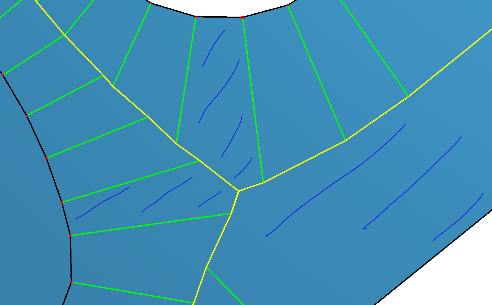

# libDrawingProcessing

# PartitionPlacement

方案一

1. 找出三通的区域 
2. 对每个三通区域进行切分，分属于不同的区域
3. 再

- 这个方案在实现完成后效果还是可以，但是还是有很大的问题
  - 很难处理骨架线的区域是凹集的情况
  - 新增了一个点在边界上，属实没必要

方案二

- 在方案一的切分区域那里

  - 遍历这个面，找到所有的交界点，就是说点分开的面大于2
  - 每个点连接到不交叉的最近的结点上，如果没有，那就自成一面

  

## TODO

- [x] CenterLine模块加入with simplifyboundray的可选项
- [x] 内缩外扩中create_interior_skeleton_and_offset_polygons_with_holes_2和create_exterior_skeleton_and_offset_polygons_with_holes_2模板类型匹配有冲突
- [ ] uncertain face中与border_edge中两个端点A和B的连线与多边形有交点，目前的处理方案考虑的情况还比较简单，只考虑一边出现交点，后面遇到更加复杂的情况可以用下面的解决方案解决

先找到与多边形的所有角点，再判断怎么怎么不产生新的交叉的切分